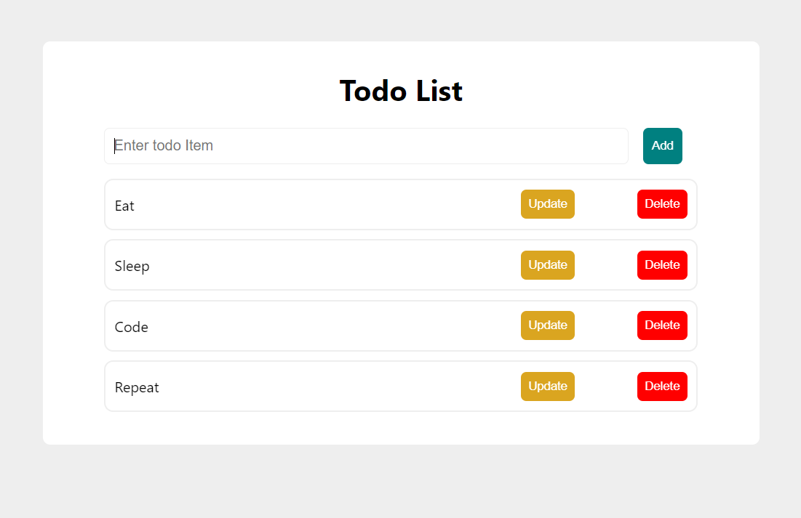

# To-Do List

This is a simple To-Do List application built with Node.js, Express.js, and React.




## Installation

To run this application locally, follow the instructions below:
###  Project Structure
The project consists of two main folders:
**server**: Contains the Node.js backend code.
**todo**: Contains the React frontend code.
The backend and frontend are connected using React Axios library for making HTTP requests.


1. Clone the repository:
   ```bash
   git clone https://github.com/sanghvirachna/To-do-List.git
   ```
2. Install dependencies:

    Navigate to the server folder:

   ```bash
     cd server
   ```
   Run the following command to install Node.js dependencies:
   ```bash
   npm install
   ```
   Navigate to the todo folder:
   ```bash
     cd ../todo
   ```
   Run the following command to install React dependencies:
   ```bash
   npm install
   ```
   Configure the server:
   Open the server/.env file and set the desired configuration values for your MongoDB URL.
   
   Start the server:
   In the server folder, run the following command:
   ```bash
   npm start
   ```
   Start the React app:

   In the todo folder, run the following command:
   ```bash
     npm start
   ```
   Open your web browser and visit http://localhost:3000 to access the To-Do List application.


# Contributing
Contributions are welcome! If you have any suggestions, improvements, or bug fixes, please feel free to submit a pull request.

# License
This project is licensed under the MIT License.
